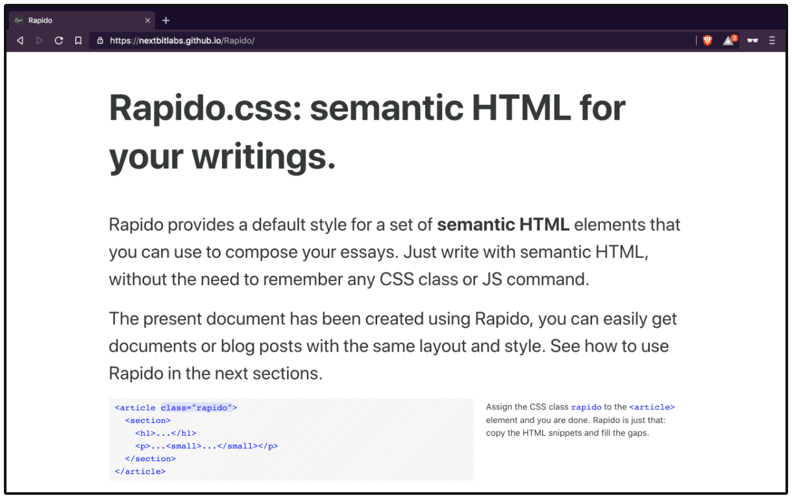

<div align="center">

# Rapido.css

Write your blog posts with semantic HTML.



</div>

## Introduction

Rapido provides a default style for a set of **semantic HTML** elements that you can use to compose your essays. Just write with semantic HTML, without the need to remember any CSS class or JS command.

Rapido has been crafted with the idea that using semantic HTML for your writings *can be easy*. For such a reason Rapido does not make use of CSS classes, with the exception of class `rapido`, of course. Authors can compose all the different parts of the document with semantic HTML elements, for example adding side notes in paragraphs with the `<small>` element.

```html
<article class="rapido">
  <section>
    <h1>...</h1>
    <p>...<small>...</small></p>
  </section>
</article>
```

## Motivation

The importance of using [semantic HTML](https://developer.mozilla.org/en-US/docs/Glossary/semantics#Semantics_in_HTML) is a common theme in web development, it is a good idea to use the relevant HTML element for the job. Semantic HTML improves the usability of the code and ensures maximum [accessibility](https://developer.mozilla.org/en-US/docs/Learn/Accessibility/HTML).

Having your own corner on the web where you can freely share thoughts or technical stuff [is still cool](https://medium.com/@dan_abramov/why-my-new-blog-isnt-on-medium-3b280282fbae), and the popularity of tools like [Jekyll](https://jekyllrb.com/) or [Gatsby](https://www.gatsbyjs.org/) proves that. Rapido intervenes there, offering semantic HTML templates for a variety of typical author needs: like header, sections, side notes, references and so on.

## Docs

Please have a look at https://nextbitlabs.github.io/Rapido/ for the documentation.

## License

This project is licensed under the MIT License. See the [LICENSE](LICENSE) file for details.
